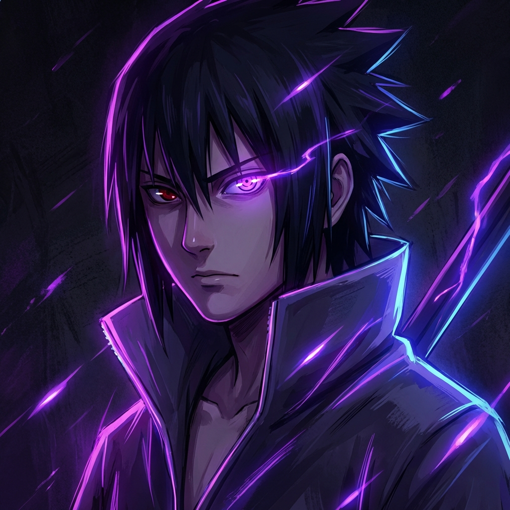
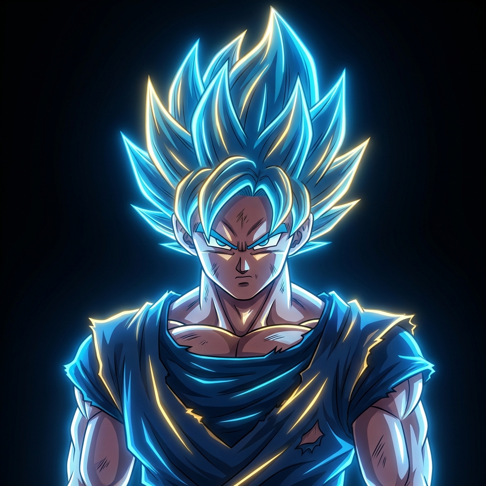
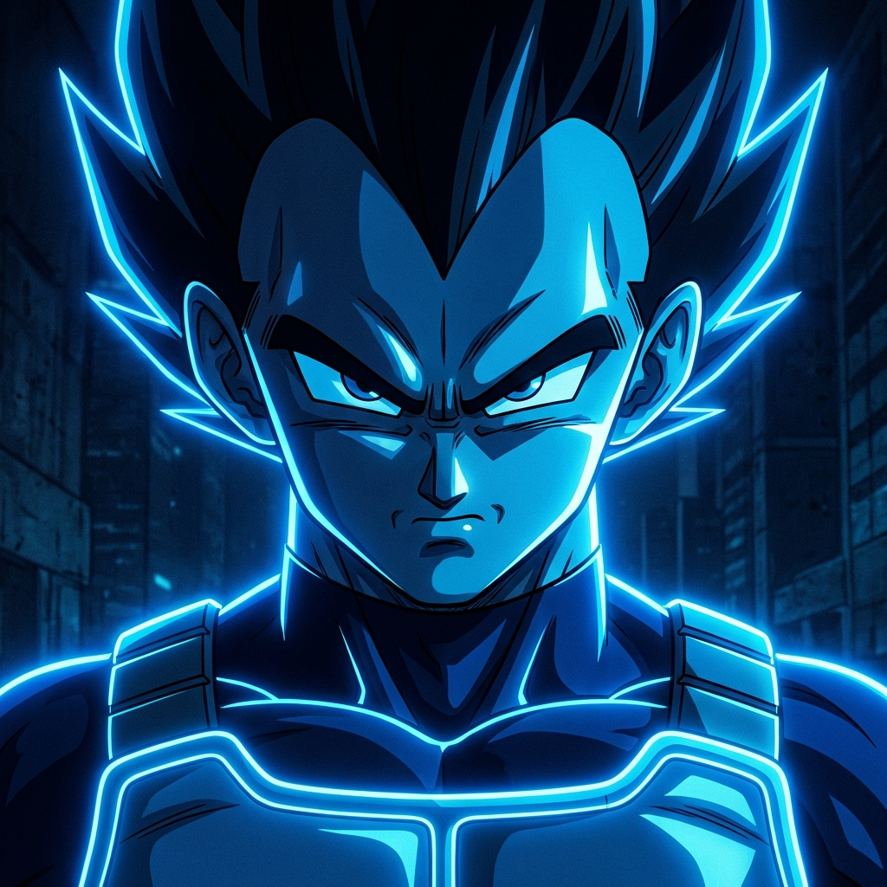
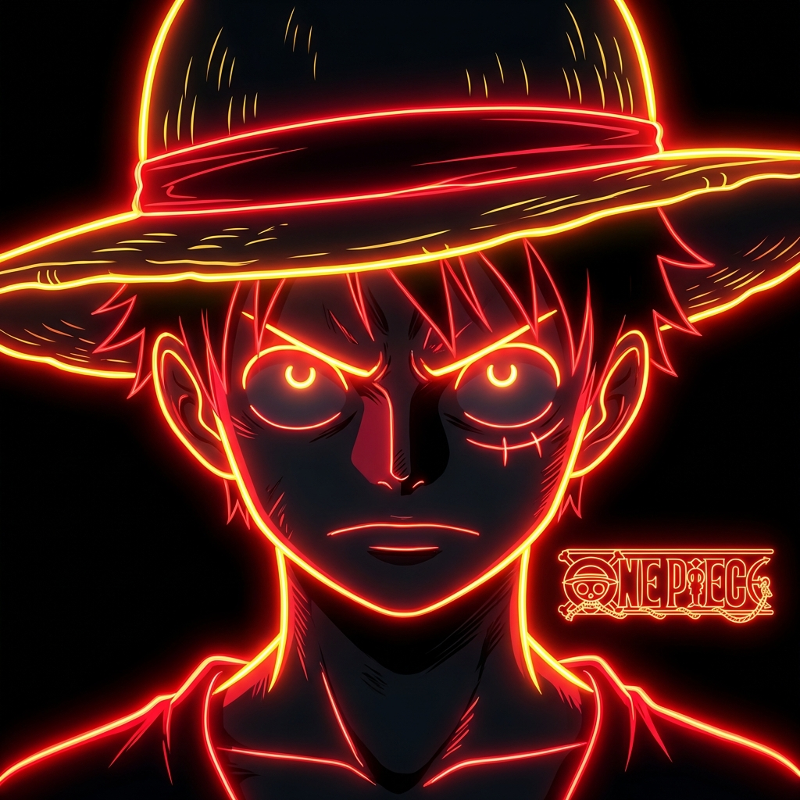

#  Anime Power Showcase

**Anime Power Showcase** is a sleek, interactive data visualization dashboard designed to compare the power levels of legendary anime characters. Built with **D3.js**, it features a sophisticated, monochrome "Dark Mode" aesthetic with smooth transitions and AI-generated portraits.

Explore the stats that define your favorite heroes and villains through dynamic radar and bar charts.

##  Featured Characters

<table align="center">
  <tr>
    <td align="center">
      <br>
      <b>Naruto Uzumaki</b>
    </td>
    <td align="center">
      <br>
      <b>Sasuke Uchiha</b>
    </td>
    <td align="center">
      <br>
      <b>Goku</b>
    </td>
  </tr>
  <tr>
    <td align="center">
      <br>
      <b>Vegeta</b>
    </td>
    <td align="center">
      <br>
      <b>Monkey D. Luffy</b>
    </td>
    <td align="center">
      <br>
      <b>Roronoa Zoro</b>
    </td>
  </tr>
</table>

*And many more powerful characters to compare!*

---
##  Features

- **Dynamic Data Visualization**: Utilize an interactive **Radar Chart** (Spider Plot) and **Bar Chart** to visualize character attributes.
- **Compare Mode**: Overlay Two characters on the same chart for a direct head-to-head power analysis.
- **Detailed Character Profiles**: Each character features raw stats, a unique special ability, and an AI-generated portrait.
- **Intelligent Power Scoring**: Automatically calculates a "Power Score" and assigns a rank (e.g., Godlike, S-Rank) based on combined stats.
- **Premium Monochrome UI**: A clean, modern "Dark Mode" interface with glassmorphism effects and smooth D3.js animations.
- **Completely Responsive**: Designed to look great on both desktop and mobile devices.

---
##  Tech Stack

- **Core**: HTML5, CSS3, JavaScript (Vanilla - no frameworks)
- **Visualization**: [D3.js v7](https://d3js.org/) (via CDN)
- **Styling**: Vanilla CSS with Grid/Flexbox
- **Assets**: AI-generated character portraits
- **Typography**: Google Fonts (Poppins)

##  How to Run Locally

Since this is a client-side application, you don't need to install any heavy dependencies.

1. **Clone the repository**:
   ```bash
   git clone https://github.com/Avanith12/ANIME_POWER_SHOWCASE.git
   ```
2. **Navigate to the folder**:
   ```bash
   cd ANIME_POWER_SHOWCASE
   ```
3. **Open the app**:
   Simply open `index.html` in your favorite web browser (Chrome, Firefox, Safari, Edge).

---

##  Credits & Disclaimer

- **Charts**: Powered by [D3.js](https://d3js.org/).
- **Stats**: Character power stats are estimates based on various anime community power-scaling discussions and are purely for visualization purposes.
- **Portraits**: Portraits were generated using AI to fit the project's unique aesthetic.
- **Anime**: All characters and series names are property of their respective creators and animation studios.

---

Made with ❤️ for Anime Fans!
to a
